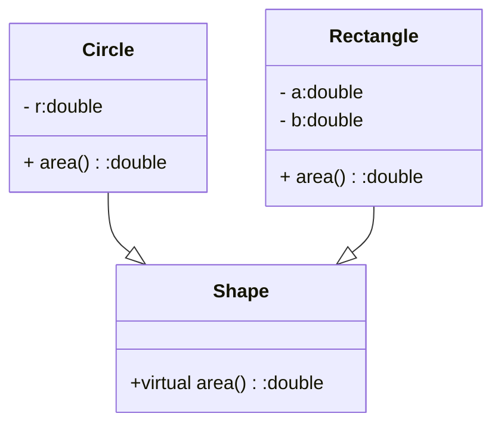

定义一个抽象基类Shape，包含纯虚函数double area()。从Shape派生两个子类，Circle和Rectangle，分别实现area函数以计算圆和矩形的面积。在main函数中创建一个Shape指针数组，包含一个Circle和一个Rectangle对象，然后调用area函数计算并输出它们的面积，画UML图。

# 代码

```C++
#include <iostream>
using namespace std;
class Shape
{
public:
    virtual double area() = 0;
};
class Circle : public Shape
{
public:
    double area()
    {
        return 3.14 * r * r;
    }
private:
    double r = 10;
};
class Rectangle : public Shape
{
public:
    double area()
    {
        return a * b;
    }
private:
    double a = 10;
    double b = 20;
};
int main()
{
    Shape* shapes[2];
    shapes[0] = new Circle();
    shapes[1] = new Rectangle();
    cout << "圆的面积为：" ;
    cout << shapes[0]->area() << endl;
    cout << "矩形的面积为：" ;
    cout << shapes[1]->area() << endl;
    for (int i = 0; i < 2; i++)
    {
        delete shapes[i];
    }
    return 0;
}
```

# UML图



