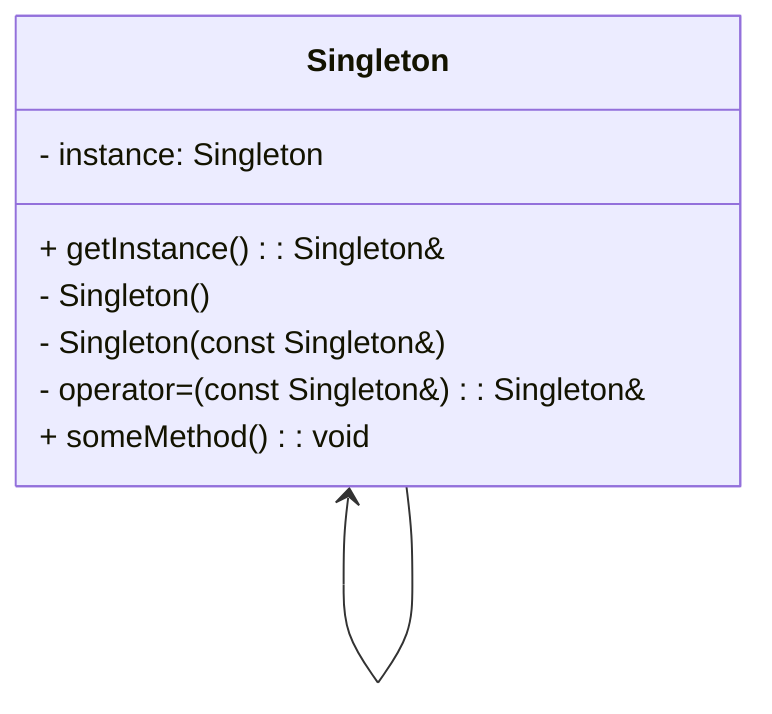
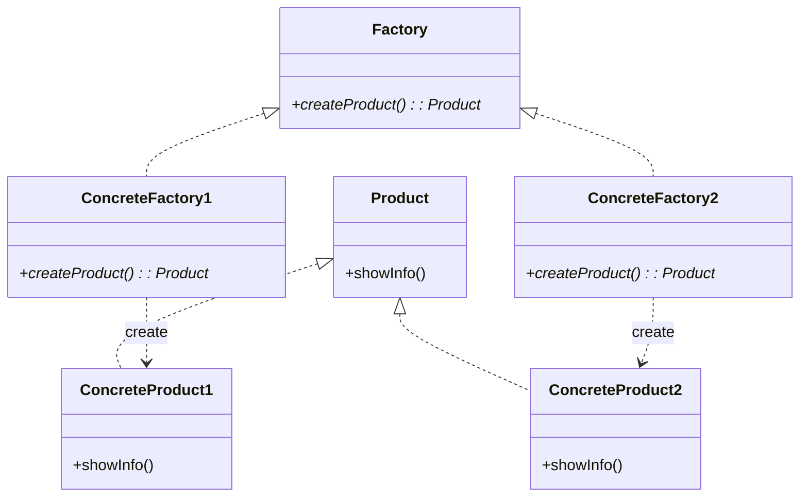
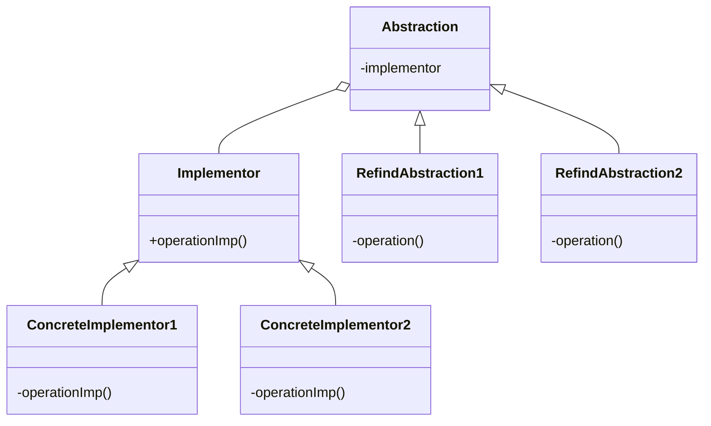
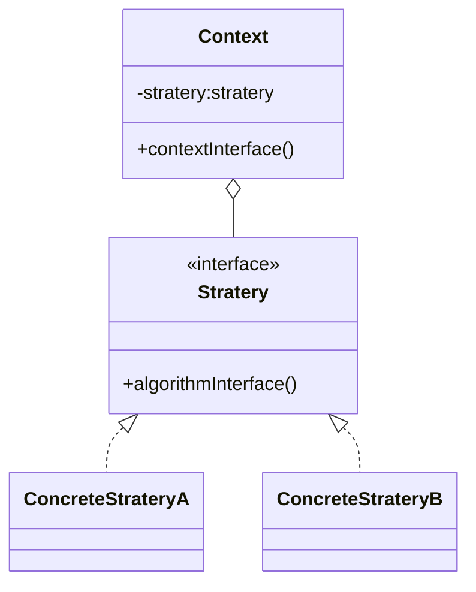

# **# 设计模式**

又称软件设计模式，是一套被反复使用、多数人知晓的、经过分类编目的、代码设计经验的总结。它描述的是软件开发过程中不断发生的问题以及问题的解决方案，其目的是为了提高代码的可重用性、代码的可读性和代码的可靠性

C++设计模式可以分为三类：创建型、结构型和行为型。

## **# 创建型模式**

单例模式（Singleton）：保证一个类仅有一个实例，并提供一个访问它的全局访问点。

工厂方法模式（Factory Method）：定义一个用于创建对象的接口，让子类决定实例化哪一个类。工厂方法使一个类的实例化延迟到其子类。

抽象工厂模式（Abstract Factory）：提供一个接口，用于创建相关或依赖对象的家族，而不需要明确指定具体类。

建造者模式（Builder）：将一个复杂对象的构建与它的表示分离，使得同样的构建过程可以创建不同的表示。

## **# 结构型模式**

适配器模式（Adapter）：将一个类的接口转换成客户希望的另外一个接口。适配器模式使得原本由于接口不兼容而不能一起工作的那些类可以一起工作。

桥接模式（Bridge）：将抽象部分与它的实现部分分离，使它们都可以独立地变化。

组合模式（Composite）：将对象组合成树形结构以表示“部分-整体”的层次结构。组合模式使得用户对单个对象和组合对象的使用具有一致性。

装饰模式（Decorator）：动态地给一个对象添加一些额外的职责。就增加功能来说，装饰模式比生成子类更为灵活。

代理模式（Proxy）：为其他对象提供一种代理以控制对这个对象的访问。

## **# 行为型模式**

责任链模式（Chain of Responsibility）：为解除请求的发送者和接收者之间耦合，而使多个对象都有机会处理这个请求。将这些对象连成一条链，并沿着这条链传递该请求，直到有一个对象处理它为止。

命令模式（Command）：将一个请求封装为一个对象，从而使你可用不同的请求对客户进行参数化；对请求排队或者记录请求日志，以及支持可撤销的操作。

解释器模式（Interpreter）：给定一个语言，定义它的文法的一种表示，并定义一个解释器，这个解释器使用该表示来解释语言中的句子。

迭代器模式（Iterator）：提供一种方法顺序访问一个聚合对象中各个元素，而又不暴露该对象的内部表示。

中介者模式（Mediator）：用一个中介对象来封装一系列的对象交互。中介者使各对象不需要显式地相互引用，从而使其耦合松散，而且可以独立地改变它们之间的交互。

观察者模式（Observer）：定义对象间的一种一对多的依赖关系，当一个对象的状态发生改变时，所有依赖于它的对象都得到通知并被自动更新。

# 四个模式

> ### 单例模式

应用场合：当需要在程序中的多个地方共享同一个实例时，比如配置管理器、日志记录器等。

理解应该是只能通过 getInstance() 获得唯一对象（示例）

包含懒汉式和饿汉式（先创建对象）

> ### 工厂模式

应用场合：当一个类无法预知它必须创建的类的对象时，或者一个类希望由其子类来指定所创建的对象时，可以使用工厂模式。

你需要生产一大类的什么使用多态实现！将**工厂抽象化**

开闭原则，扩展一个新的类，而不是修改原有的代码，就是不要动封装的类，我只会多态

> ### 桥接

应用场合：当一个类存在两个独立变化的维度，且需要在这两个维度上进行扩展时，可以使用桥接模式。

> ### 策略

应用场合： 策略模式定义了一族算法，将每个算法分别封装起来，并且使它们之间可以相互替换。

