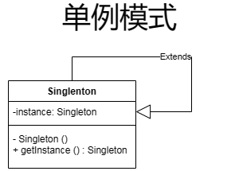
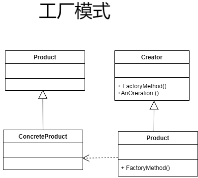
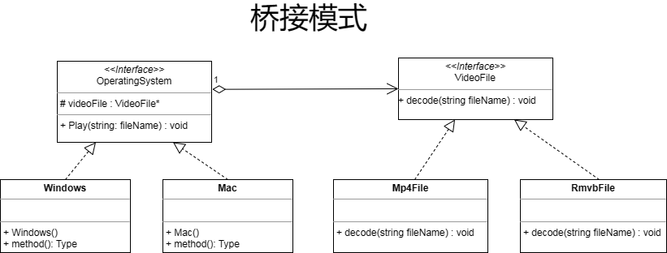
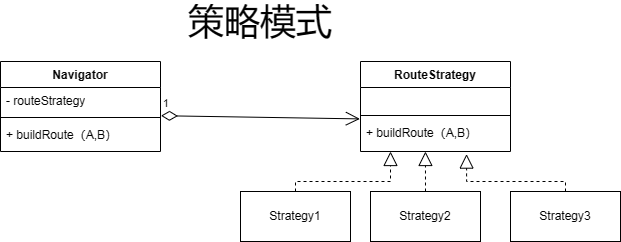

### 单例模式 (Singleton Pattern):

**UML 图:**

**应用场合:**

- 当系统中需要确保某个类只有一个实例时。
- 例如，数据库连接池、日志记录器等。

### 工厂模式 (Factory Pattern):

**UML 图:**

**应用场合:**

- 当系统中的某个类的创建过程比较复杂，需要隐藏起来时。
- 例如，GUI 框架中的控件创建、数据库访问层的对象创建等。

### 桥接模式 (Bridge Pattern):

**UML 图:**

**应用场合:**

- 当系统需要在抽象和实现之间引入灵活性时。
- 例如，操作系统的文件系统抽象和具体实现、遥控器和设备之间的解耦。

### 策略模式 (Strategy Pattern):

**UML 图:**

**应用场合:**

- 当系统中有多种算法或行为，需要在运行时动态选择时。
- 例如，排序算法、图像处理中的滤镜选择等。

