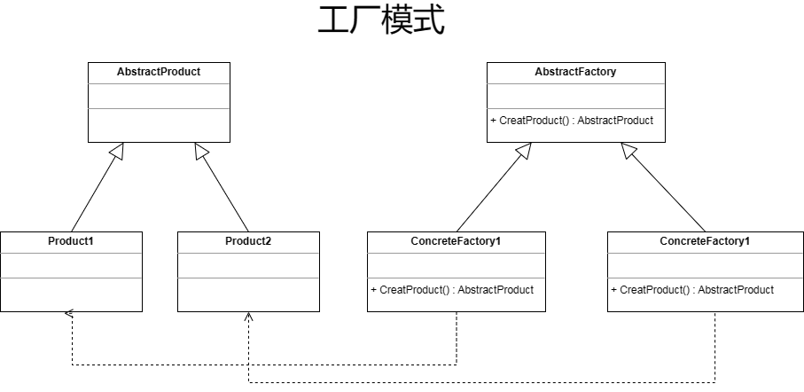

### 单例模式 (Singleton Pattern):

**UML 图:**

**应用场合:**

1. 当需要确保类只有一个实例时，可以使用单例模式。

2. 当需要提供一个全局访问点时，可以使用单例模式。

3. 当类需要频繁创建和销毁，且创建和销毁的开销较大时，可以使用单例模式。

4. 当类需要与其他类共享资源时，可以使用单例模式。

### 工厂模式 (Factory Pattern):

**UML 图:**

**应用场合:**

1. 当需要创建的对象具有共同父类或接口时，可以使用简单工厂模式。

2. 当对象的创建过程需要根据不同条件进行动态判断时，可以使用工厂方法模式。

3. 当系统中存在多个产品族，且每个产品族具有类似的创建逻辑时，可以使用抽象工厂模式。

4. 当需要将创建对象的具体过程与使用代码分离，提高代码的可维护性和可扩展性时，可以使用工厂方法模式。

### 桥接模式 (Bridge Pattern):

**UML 图:**

**应用场合:**

1. 当需要将不同类型的对象组合在一起时，桥接模式可以发挥作用。它允许用户以统一的方式处理不同类型的对象，简化客户端的代码。

2. 当对象的抽象部分与实现部分紧密耦合时，桥接模式可以帮助解耦。通过将抽象部分与实现部分分离，桥接模式提高了代码的可维护性和可扩展性。

3. 当需要将新的对象添加到现有系统中时，桥接模式可以简化这个过程。通过将新对象与现有系统的抽象部分进行桥接，可以减少代码的修改量和风险。

4. 当需要实现代码复用和多态时，桥接模式可以发挥作用。通过将不同类型的对象统一到一起，桥接模式允许用户以一致的方式处理各类对象，提高代码的复用性和灵活性。

### 策略模式 (Strategy Pattern):

**UML 图:**

**应用场合:**

1. 多个类只区别在表现行为不同：在这种情况下，可以使用策略模式在运行时动态选择具体要执行的行为。

2. 需要在不同情况下使用不同的策略（算法）：当你需要在不同情况下使用不同的算法时，可以使用策略模式。

3. 算法可能在未来用其它方式来实现：当算法可能会随着时间的推移而变化时，可以使用策略模式以便于在未来轻松地更换或修改算法。

4. 对外隐藏具体策略（算法）的实现细节：通过使用策略模式，可以确保客户只需关注上下文对象，而无需关心具体的算法实现。

