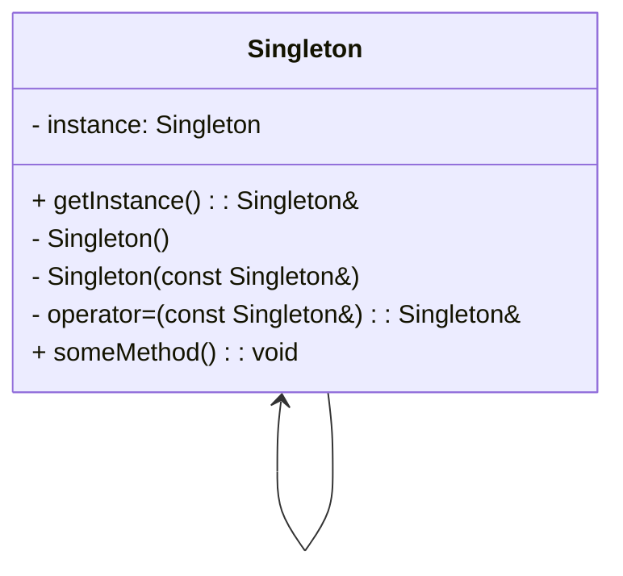
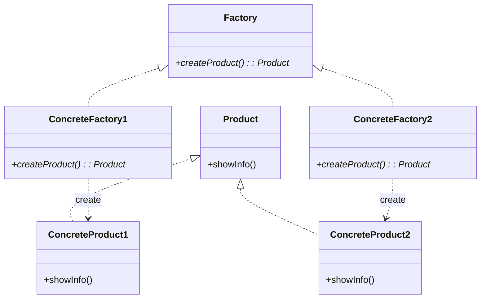
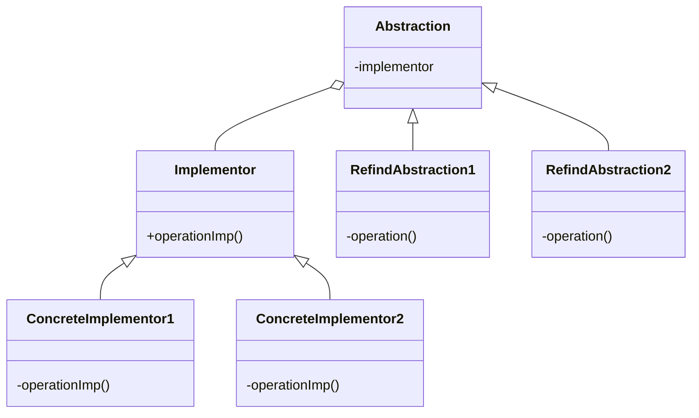
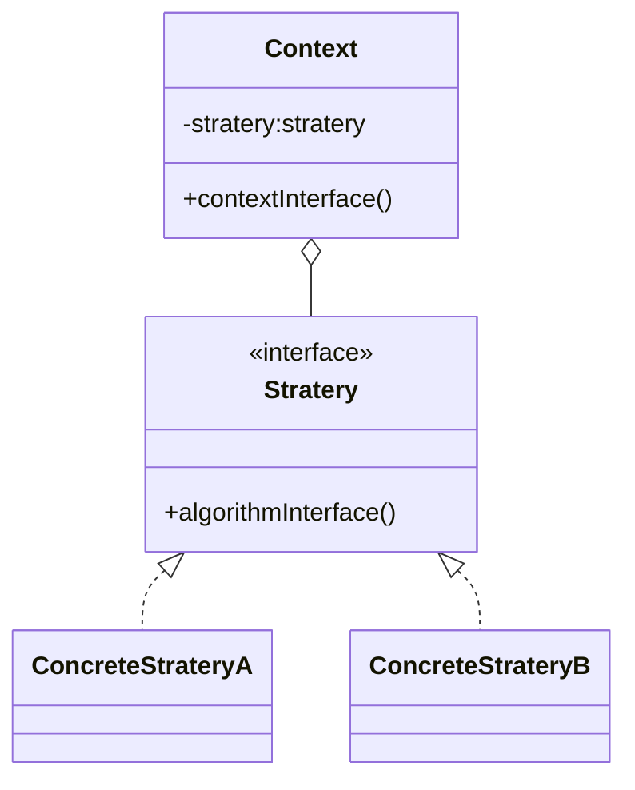

# 四个模式

> ### 单例模式

应用场合：当需要在程序中的多个地方共享同一个实例时，比如配置管理器、日志记录器等。

理解应该是只能通过 getInstance() 获得唯一对象（示例）

包含懒汉式和饿汉式（先创建对象）

> ### 工厂模式

应用场合：当一个类无法预知它必须创建的类的对象时，或者一个类希望由其子类来指定所创建的对象时，可以使用工厂模式。

你需要生产一大类的什么使用多态实现！将**工厂抽象化**

开闭原则，扩展一个新的类，而不是修改原有的代码，就是不要动封装的类，我只会多态

> ### 桥接

应用场合：当一个类存在两个独立变化的维度，且需要在这两个维度上进行扩展时，可以使用桥接模式。

> ### 策略

应用场合： 策略模式定义了一族算法，将每个算法分别封装起来，并且使它们之间可以相互替换。

