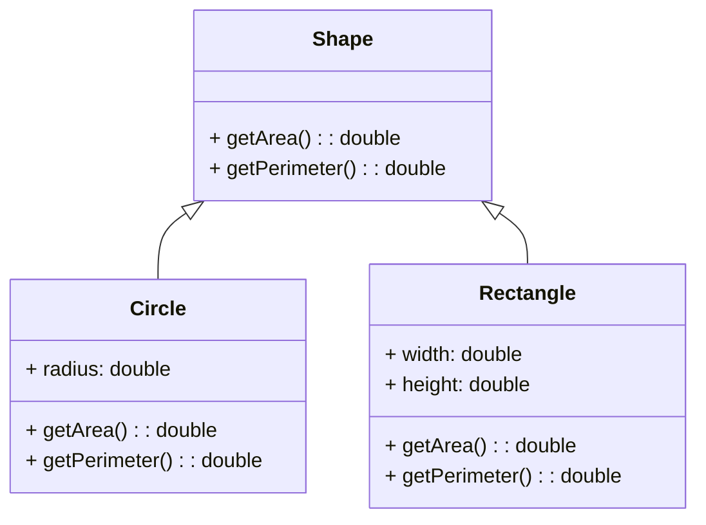

### 按要求绘制UML类图如下：

> 解释说明：
>
> - 基类 `Shape` 定义了公共的方法 `getArea()` 和 `getPerimeter()`，分别用于计算面积和周长。
> - 派生类 `Circle` 继承自 `Shape`，并新增了半径 (`radius`) 成员变量，以及重写了基类的方法来计算圆的面积和周长。
> - 派生类 `Rectangle` 继承自 `Shape`，并新增了宽度 (`width`) 和高度 (`height 成员变量，以及重写了基类的方法来计算矩形的面积和周长。