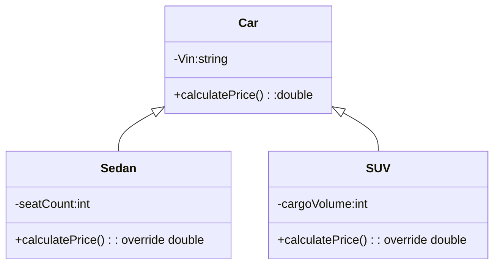

```mermaid
classDiagram
   class Car{
       -Vin:string 
       +calculatePrice():double
   }

   class Sedan{
     -seatCount:int
     +calculatePrice() : override double  
   }

   class SUV{
     -cargoVolume:int
     +calculatePrice() : override double
   }

   Car <|-- Sedan
   Car <|-- SUV
```
