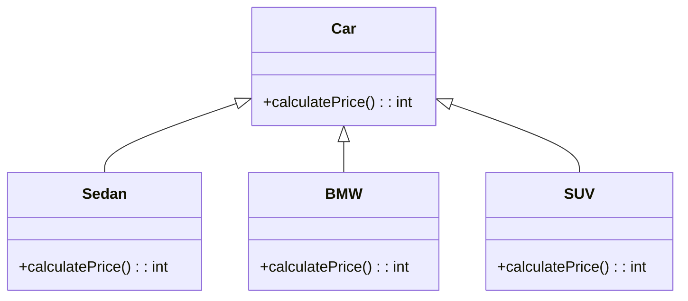

```mermaid
classDiagram
	class Car{
		+calculatePrice() : int
	}
	class Sedan{
		+calculatePrice() : int
	}
	class SUV{
		+calculatePrice() : int
	}
	class BMW{
		+calculatePrice() : int
	}
	Car <|-- Sedan
	Car <|-- BMW
	Car <|-- SUV
```

